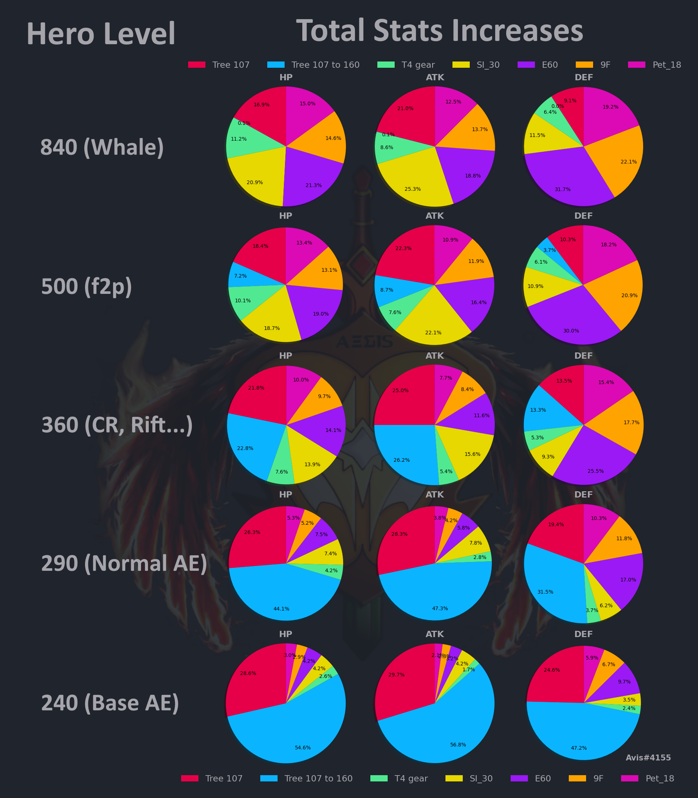
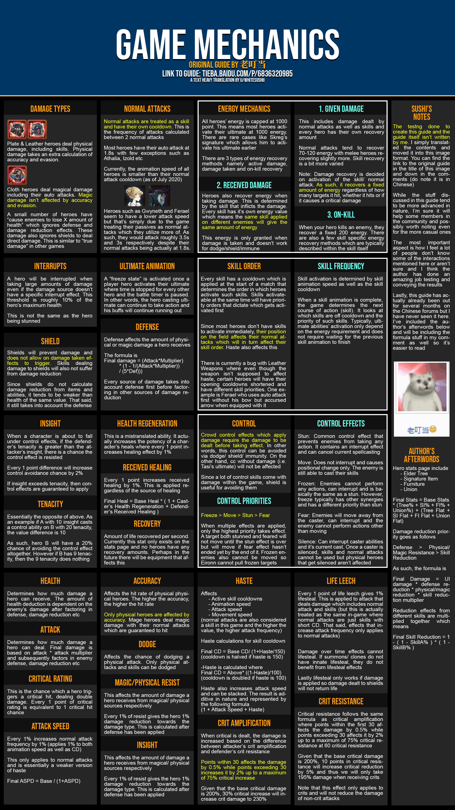
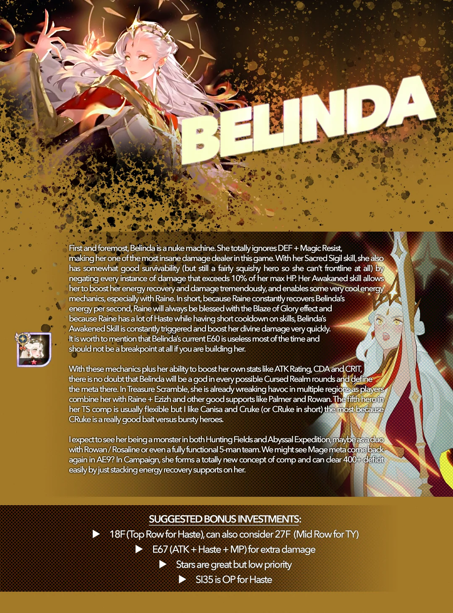
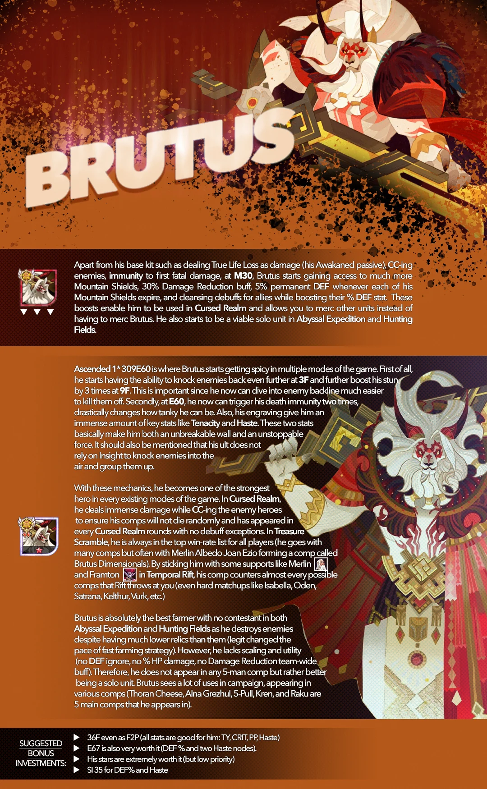
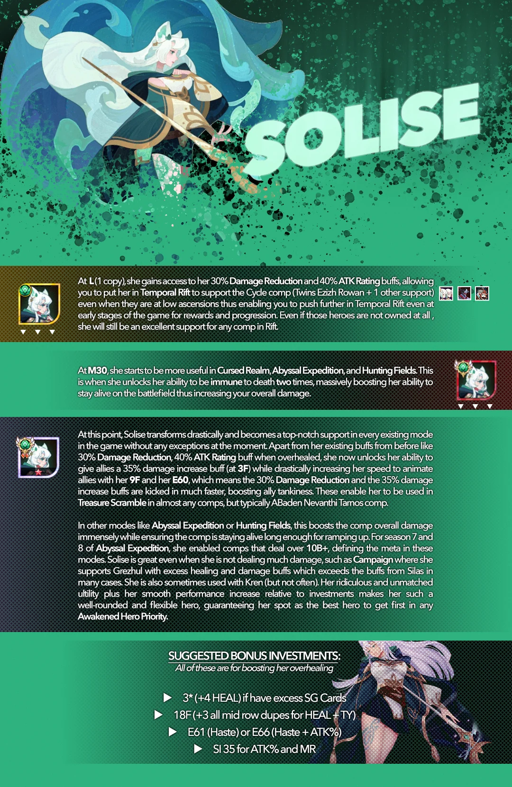
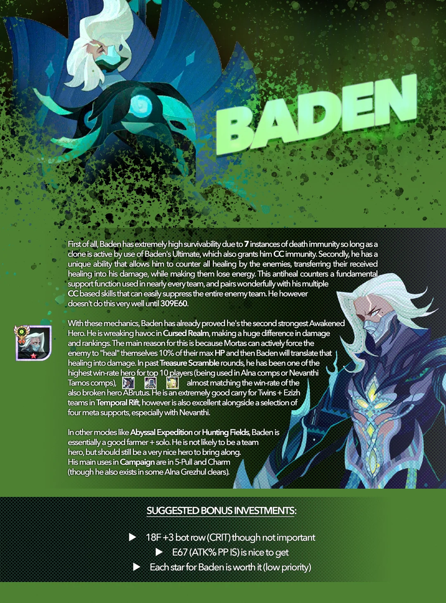
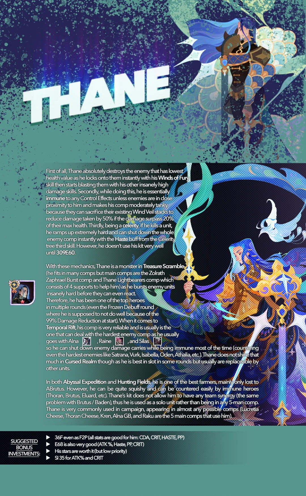

# Picture respesentations

## Stats value level dependant

## Game mechanics

## Awk. Heroes

|  |  |
| ------------------------- | ------------------------- |
|  |  |
|  |   |

## Furniture enchant + stats

{{ read_excel('../assets/furnstats.xlsx', engine='openpyxl', na_filter=False) }}