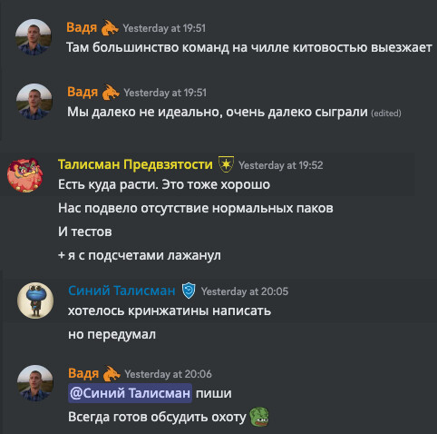
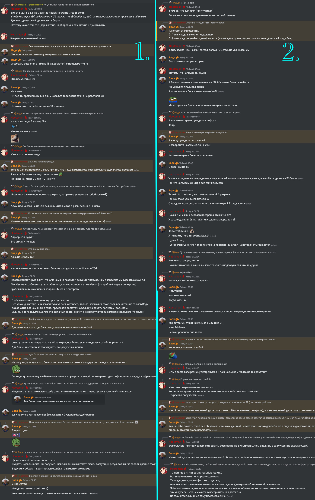

# Рак сообщества { .red-font }

!!! attention "«Беспощадные[^tn]» соги!"
      Прошу!  
      Уделите немного внимания/времени данному посту.
      Найдите силы прочитать  
      Это важно для уютной атмосферы в нашей гильдии!

[^tn]: NO MERCY дословно можно перевести как "без пощады" или "без жалости" :kappa:

Хочется разобрать на наглядном примере  
(_пока он есть под рукой_)  
Как (_порой_) важно **внимание к мелочам** и как банальная _безответственность_ может повлечь за собой не самые приятные последствия.

_Спонсором данного текста является ночная дискуссия с субъектом относительно охоты_  
_Контекст важен, поэтому привожу весь диалог на картинке_

|                               First                               |
| :---------------------------------------------------------------: |
|  |
|                               Later                               |
|                               |

Если коротко, то в **1ой** части случилось банальное недопонимание  
_Субъект_ в контексте охоты под словом _чилл_ подразумевает команды

> допустившие хоть раз критическую ошибку в забеге

Казалось бы, _что тут такого?_  
_"Ну вот такое у него восприятие, да и к тому же это же субъект..."_ - может кто-то сказать и будет по своему прав.

Но давай-те посмотрим не со своей точки зрения,
А объективно со стороны.  
(людей не обладающих знанием о тонкой душевной организации субъекта):

- Гильдия **А**, турнир **H**
- **Результаты** в H определяются по **3 равнозначным критериям**:
  1. **Команда** с хорошим уровнем координации и степенью **вовлеченности**
  2. **Стратегия**/План на игру
  3. Минимальный **мета набор у 2-3 игроков** в команде,
- Чат гильдий **А** и **Б** (_~150 человек суммарно_)
- Член гильдии **Х** играет в команде **S**
- **S** по итогам занимает позицию в **топ-10** глобала.
- **Х** оценивает соперников в **Н** как

  > _Там большинство команд на чилле китовостью выезжает_.

  Этот тезис, сам по себе, явно не отвечает критериям успешности

- Ранее другой игрок **Z** из **А** интересуется:
  > Такой как я вообще имеет шанс в охоте или там только кракены?

**Подумайте**:

1. Можно ли считать **Х** мнение в данном вопросе **авторитетным**?
2. Какое впечатление сложится о **своих** шансах у **Z**?
3. Что ответит, не обладающий опытом, игрок **N+** из **Б**, своему другу из гильдии **Q**, если тот его спросит про **H**?
4. Будут ли другие последствия, от беспечного отношения игрока **X**?
5. Какие шансы что 150 человек знают о тонкостях мировоззрений **Х**?

Отдавал ли себе X отчет о возможных последствиях своих слов?  
Сомнительно.
И его можно было бы понять ~~и простить~~!  
Но  
**Достижение успехов/авторитетность/власть - автоматически влечет за собой ответственность перед людьми**
за предоставляемую инфу в зоне этого самого успеха/авторитета как минимум (а иногда больше).
(нравится это кому-то или нет, это факт)

Обремененный ответственностью субъект - облажался.  
Вводил общественность в заблуждение только в примере выше несколько раз.  
И ноет с завидной регулярностью по моим наблюдениям.

## Это касается всех

Почему это важно?
Общее настроение в сообществе формируется в т.ч. из таких вот мелочей.
Стоит ли говорить как могут деформироваться такие _острые вбросы_?
(В силу известного эффекта сарафанного радио)

Когда колесо сансара даст круг,
Субъекту на глаза может легко попасться что-то такое:

> ШОК СЕНСАЦИЯ  
> У китайских кракенов на старте в охоте мяса в два раза больше чем у европейских

Догадается что корни лежат в его же тезисе, который он халатно бросил ранее?  
Не известно.
Но нытья и уныния точно добавит всем.

Случай Вади конечно же не уникален.
Схожую халатность мы с вами наблюдаем достаточно регулярно
_(когда человек имеющий экспертизу/авторитет/власть не осознает последствий своих слов)_
И чем больше авторитет/власть, тем серьезней _(обычно)_ последствия.

За примерами далеко ходить не приходится:

- стоит вспомнить страну в которой живем :kappa:
- или недавний вброс про "про нерф скилла ПБадена"
  (который на проверку, оказался фиксом босса, причем это явно прописано в источнике...
  но человек принесший это в чат _не удосужился_ даже _прочитать_ то что вбрасывает)
- это одна из причин развала Хоспа.
  _(и, возможно, причина моего личного триггера на такого рода людей)_

Думаю каждый, если задумается на секунду, легко вспомнит случаи из своего опыта.

## Хочется сказать

**Друзья**,  
давай-те относиться друг к другу с **уважением**,  
**Уделяйте** немного времени для осознания _что, как, кому_ и для _чего_ вы пишите. Какую **цель** преследуете?  
**Проведите** мысленную оценку **как** это может быть воспринято **остальными** возможными читателями?  
Хотя бы в **гильдейском чате**.

_Потеха своего ЧСВ, вбросы откровенной "желтухи", вечное нытье_ и т.д.  
Явное **неуважение** не только **к собеседникам**, но и **к себе** в каком-то роде.  
Наблюдение этого в ги чате - крайне печалит.  
_(переодически и завидной регулярностью)_

Вот и все чем хотел поделиться.  
Спасибо тем кто внимательно прочитал до конца.

Возможно я слишком предвзят и вижу того чего нет.  
(_печальной опыт может влиять на восприятие_)  
Каждый решит сам. Надеюсь мысль донести верно получилось.
У меня нет ни к кому личных претензий.
Триггер на любое проявление неуважения, есть.

**Всем добра и хорошего настроения!**
