## 1. Подарок

### История Delian

<figure markdown>

|                   Хроника событий                    |                       _Привет_                       |
|:----------------------------------------------------:|:----------------------------------------------------:|
| 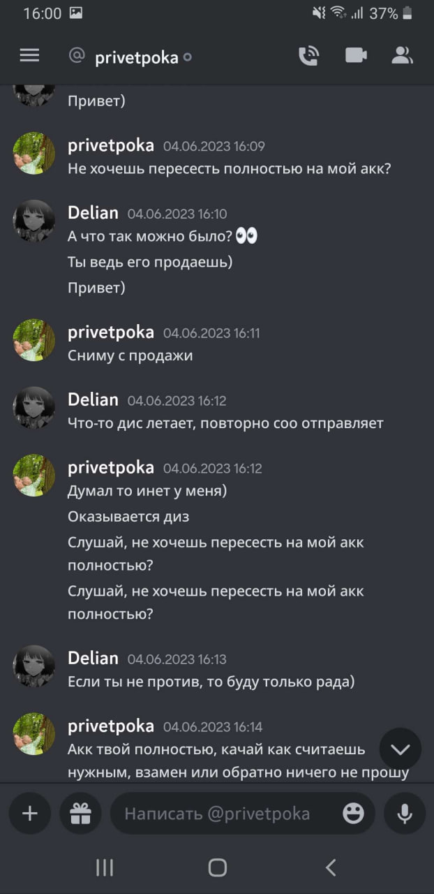 | 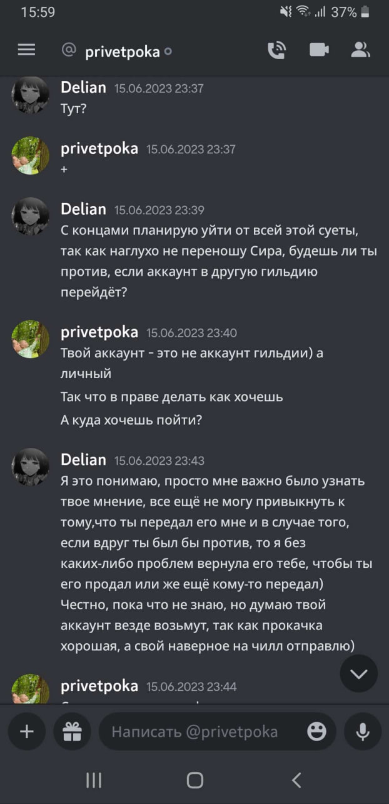 |
|  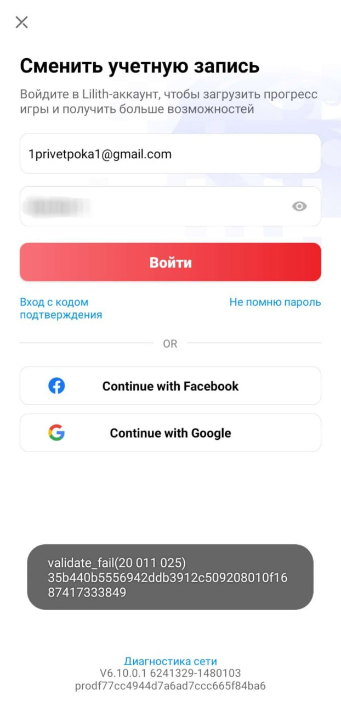  |  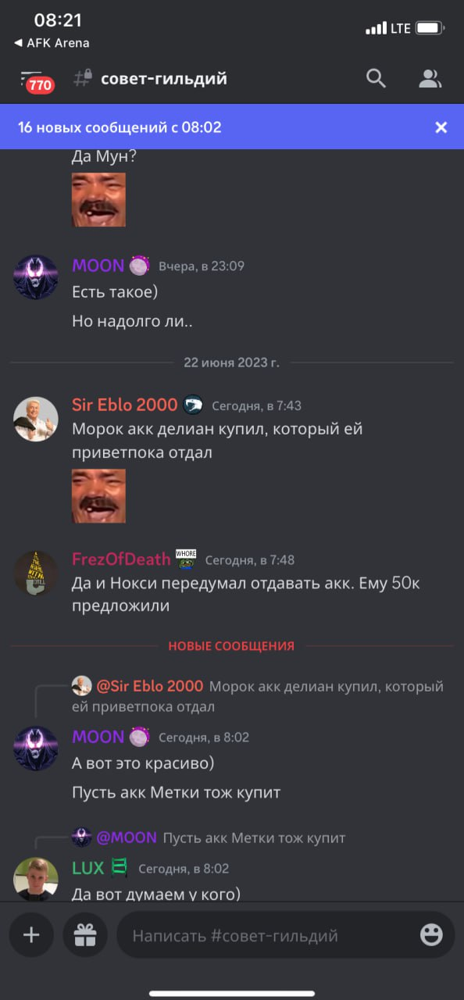  |
|                                                      |                      **_Пока_**                      |

<figcaption></figcaption>
</figure>
<figure markdown>

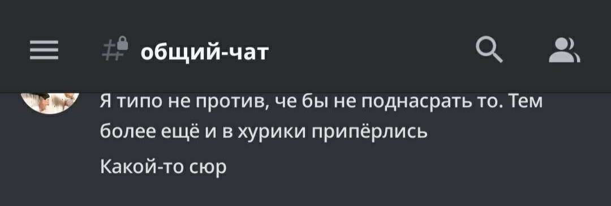

<figcaption>Новый владелец аккаунта, он же Морок</figcaption>
</figure>

### Реакция пострадавшей стороны

!!! quote "![deli][5]{width=32} **_Delian_**"

    >Не думаю, что моя информация принесёт хоть какой-то толк, так как аккаунт не был куплен, предыдущий владелец с которым мы были в
    хороших отношениях, попросту решил отдать его мне. :)  
    С Аквой были довольно натянутые отношения.  
    Были конфликты с некоторыми личностями, но в последнее время с Сиром.  
    Человек привык к тому, что он главный и что все полоумно должны слушаться его, я же не всегда соглашалась с ним, вступала в спор, который переходил на срач, после чего получала кик с сервера, либо мут на 6 дней.  
    Чисто из-за того, что высказывала свое мнение, как и другие ребята, которых не устраивало поведение Сира, точнее его отношение к людям.  
    Сама не являюсь идеальным человеком, было много косяков, но такие поступки максимально низкие.  
    Сколь бы сильно тебе был неприятен человек, зачем подговаривать своих согильдийцев поступать столь подло?  
    До выхода из гильдии списалась с человеком, мол не будет ли он против того, что перейду в другую гильдию, так как мне было предельно важно узнать его мнение.  
    Будь он против, то без проблем передала бы аккаунт ему, а если бы дал добро, то тут уже понятно.  
    Спустя какое-то время ушла из гильдии, вступила в Хурики.  
    Буквально день просидела, а утром уже минус аккаунт был.  
    Как мне сказали, Морок с которым у нас были плохие отношения, который состоит в акве, решил поднасрать и ночью купил аккаунт.  
    Помимо этого, аква решила поднасрать и другому игроку - Черная Метка, хотели связаться с человеком у которого она купила аккаунт.  

### Независимое мнение

!!! quote "![hoot][13]{width=32} _**HOOTSMAN**_, Лев Николаевич"

    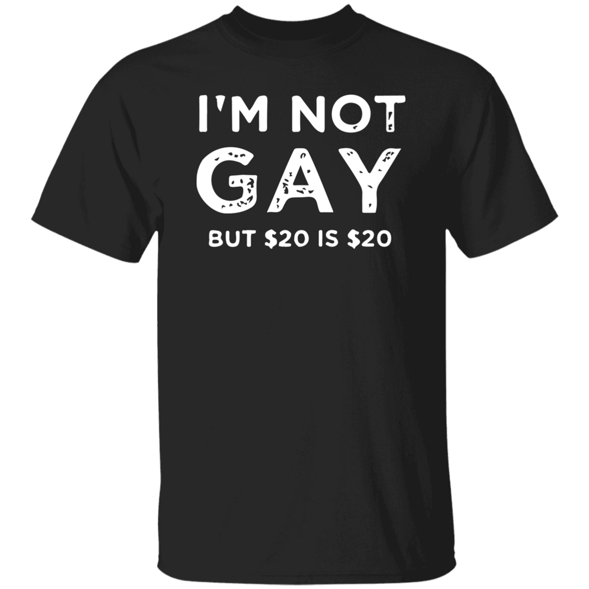{ align=right width=210}
    В произошедшем инциденте,  
    чисто технически, никто никому ничего не должен.  
    Ваши ожидания исключительно ваши проблемы, как говорится.  
    Но по человечески, по _совести_, крайне сомнительное поведение.  
    Пусть это остается на совести первоначального владельца аккаунта, карма обязательно возьмет свое.  
    Можно вручить ему подарок даже, отличная футболка!

## 2. Ass We Can

### История Assmodeus

!!! info "Действующие лица"

    - _phoenixdanay_ так же известный как _Assmodeus_
    - _Эмбер_ - Игрок давно продавший акк _Асмодеусу_, который в последствии был продан _Черной Метке_.
    - Pohoyoo - HH Aquilon
    - _Черная метка_- Купила аккаунт у _Pohoyoo_, который был **отдан** <u>Ассмодеусом</u> _Pohoyoo_ при условии, что его не продадут
    - _Ингвар, Sir Eblo 2.000[^ss]_ или _Дааа_ - Состоит в совете Аквилона, был не против выкупить акк у Ассмодеуса
    - _Сир, Sir Eblo 2000_ - **ГМ Аквилона**
    - _Эликсир_ - владелец аккаунта _Ассмодеуса_

[^ss]: "Подражает ГМу аквы, но это два разных участника событий."

#### Начало

!!! quote "![assm][4]{width=32} **_Assmodeus_**"

    >Изначально играл на аккаунте _Эмбера_, на котором сейчас играет Метка. Потом главный HR Аквы _Pohoyoo_ приводит _Elitsire_ в Акву, но тот вскоре уходит из игры, оставив аккаунт _Pohoyoo_. Мы с ним договариваемся о том, что я выкупаю аккаунт _Elitsir_'а за 20к рублей + отдаю дельфиний акк _Эмбера_ и он на нем будет играть.

    Диалог по поводу выкупа аккаунта _Elitsire_ ниже на скриншотах.

    >**Договоренности**: Аккаунт _Elitsir_ остается в акве, акк _Эмбера_, с которого пересел я, не продается на случай, если владелец Элитсира возвращается в игру, я тогда пересаживаюсь обратно.

<figure markdown>

|  1. ![1][l1] ![2][l2]  |  2. ![3][l3]{width=300}   |  3. ![4][l4]   |
|:----------------------:|:-------------------------:|:--------------:|
| 4. ![5][l5]{width=300} |        5. ![6][l6]        |  6. ![7][l7]   |
|      7. ![8][l8]       |  8. ![9][l9]{width=1000}  | 9. ![10][l10]  |
|     10. ![11][l11]     |       11 ![12][l12]       | 12. ![13][l13] |
|     13. ![14][l14]     | 14. ![15][l15]{width=200} |                |

[l1]: ../../assets/images/aquavon/image.png
[l2]: ../../assets/images/aquavon/image-1.png
[l3]: ../../assets/images/aquavon/image-2.png
[l4]: ../../assets/images/aquavon/image-3.png
[l5]: ../../assets/images/aquavon/image-4.png
[l6]: ../../assets/images/aquavon/image-5.png
[l7]: ../../assets/images/aquavon/image-6.png
[l8]: ../../assets/images/aquavon/image-7.png
[l9]: ../../assets/images/aquavon/image-8.png
[l10]: ../../assets/images/aquavon/image-9.png
[l11]: ../../assets/images/aquavon/image-10.png
[l12]: ../../assets/images/aquavon/image-11.png
[l13]: ../../assets/images/aquavon/image-12.png
[l14]: ../../assets/images/aquavon/image-13.png
[l15]: ../../assets/images/aquavon/image-14.png

<figcaption>Сделка</figcaption>
</figure>

#### Сходка

!!! quote "![assm][4]{width=32} **_Assmodeus_**"

    На сходке Аквилона выясняется, что _pohoyoo_ продал аккаунт Ember, на который в случае чего я должен был пересесть, Метке и утверждает, что Элитсир точно не вернется в игру.  
    
    Начало непоняток в Аквилоне: крайне токсичная атмосфера, разборки до и во время бездны.  
    Отношение совета(гильдий?) к факту подлого отжатия аккаунта у Делиан
    В дискорде регулярно творилась жесть в плане отношения к людям, постоянные оскорбления, унижения и перегиб с полномочиями, мне это совершенно не нравилось.  
    
    Морок сам у ПП(ПриветПока) акк Делиан купил, но убил сам факт "поддержки" совета поднасрать ей.  
    Не хочу, чтобы получилось так, будто меня подговорили уйти с ГИ, ведь это абсолютно не так.  
    Сир уже думает, что у нас существует Коалиция "АНТИ СИР", с чего я поржал. Волнения из-за постоянных токсичных разборок в Акве, где совет со стороны Аквы мог делать все, что захочется. Сир подшофе мог зайти в дискорд и просто так всех отчленососить(др.словами) и недовольные этим игроки, если высказывались сразу попадали в мут, или вообще исключались из дискорда. Потом Сир их возвращал, конечно. С "барского плеча", так сказать. Когда создалась Коалиция[^coal], люди из совета мне говорили, что специально сделали так, чтобы ГМ не могли исключать игрока из другой гильдии., но никто не отменял муты. В Акве единственное верное мнение и решение только у Сира, только жаль, что с ним были многие не согласны, и несогласные делились на два лагеря:

      1) Не согласны, ну и не обращать на него внимание.  
      2) Не согласны, и получать мут или оскорбления за высказывания противоположного мнения

    Ведь Сир любит говорить, что мы воюем против ветра. Вся эта шняга гнилая, которая происходила в совете мне была интересна, я хотел понять, с какой тактикой вообще Сир работает. Я не хотел уходить из Коалиции 3 гильдий, поскольку было много добрых и хороших ребят, с которыми было комфортно. Про Сира некоторые говорили, что он весьма адекватен, если 1 на 1 общаться, и понимает что происходит. Но самое противное - его Эго, которое убивало напрочь желание играть в Акве. Ведь все ОН, все благодаря ЕМУ, всех может поносить, и как он скажет, так и будет.

[^coal]: Коалиция состояла из трех гильдий - Этернум, Бореас, Аквилон

??? danger "МНОГО НЕЦЕНЗУРНОЙ ЛЕКСИКИ"

    ![сир сапожник][1] ![сир сапожник][2] ![сир сапожник][3] 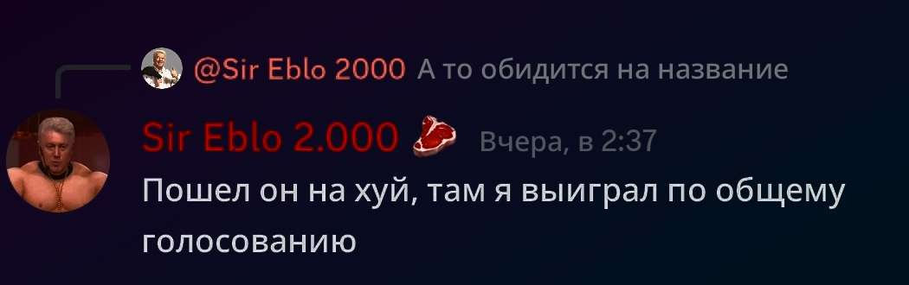 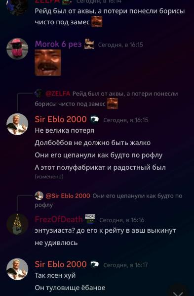

!!! info "О Delian"

    | Дружный коллектив                                                         | Отзывчивое руководство                                      |
    |---------------------------------------------------------------------------|-------------------------------------------------------------|
    | 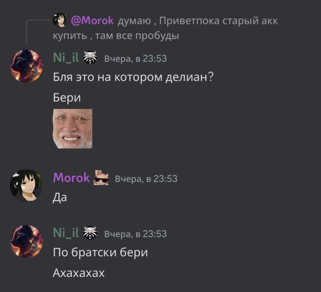{width=300} | 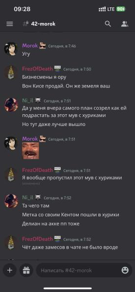 |

!!! quote "![assm][4]{width=32} **_Assmodeus_**"

    Внезапно мне пишут: 
    > Не донать в акк, помяни мое слово, отожмут аккаунт"

    {width=400}

    Я пишу Сиру по поводу предостережений, что аккаунт отожмут, состоялся долгий и весьма в добром ключе разговор.
    Одна из тем, где я отыграю бездну, я собирался остаться в Этернумах. Так же подробно обсуждали прошедшие срачи и беспокойство, что заберут у меня аккаунт.
    
    | 1. 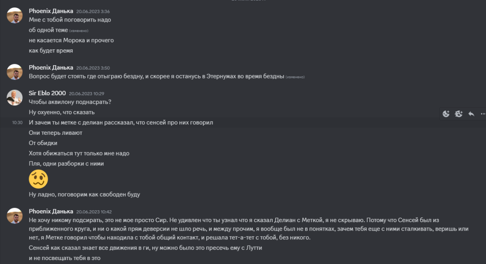 | 2. 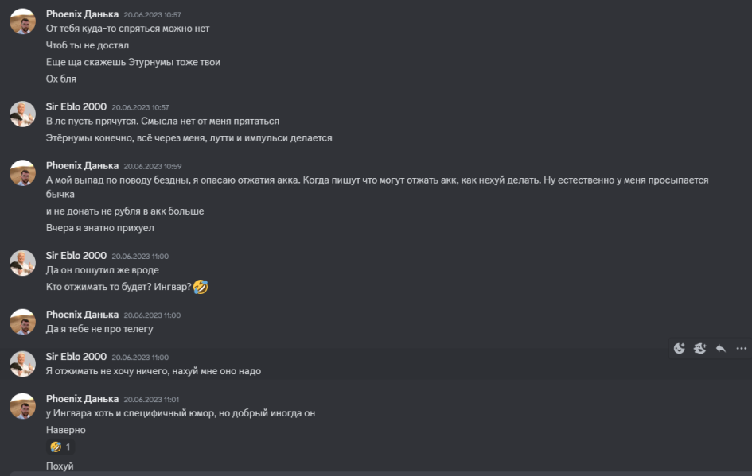 |
    |----------------------------------------------------------|----------------------------------------------------------|
    | 3.  | 4. 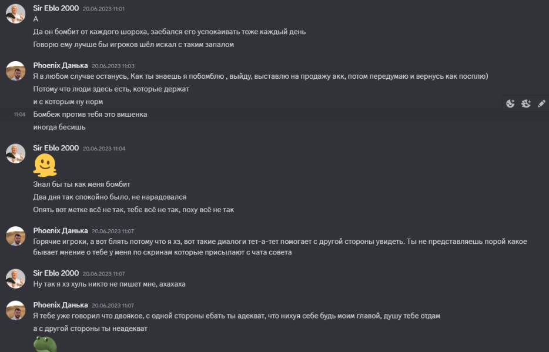 |

!!! quote "![assm][4]{width=32} **_Assmodeus_**"

    Написал <pohoyoo>, заверил, что никто не заберет аккаунт. 

    *Я подумал, что могу играть где захочу, ведь не написали, что надо играть точно в акве. (Видео с перепиской и Войсами)

    

        <video width="320" height="240" controls>
            <source src="/afk.GG/assets/vids/assmodeus.webm" type="video/webm">
        </video>  
    В войсе: Assmodeus, Сир и зам Бореас.
    

    говорил по поводу бездны в Этернума, но Сир приказывает мне играть в Акве, мол, "вы получили аккаунты благодаря Акве, вы мне обязаны", после чего состоится такой диалог:
    -Если что, Ингвар(Даа и в дисе Sir Eblo 2.000) выкупит акк, если ты продолжишь трахать(др.словами) мозги. Если хватит тебе совести.
    -Совести хватит
    -Ну и слабак, мог бы спокойно отыграть с нами.
    Желания продолжать разговор уже не было, я сказал что уйду поработать. Сразу же после войса написал Ингвару о предложении выкупа.
    •Диалог с Ингваром(удаленный мной) в телеграмме

    *Содержание: выкуп аккаунта, примерно подсчитаю донат, скину скрины. Ингвар прочитал, но не отвечал.

!!! quote "![assm][4]{width=32} **_Assmodeus_**"

    Узнавал у другого согильдийца Аквы, может ли он выкупить аккаунт.
    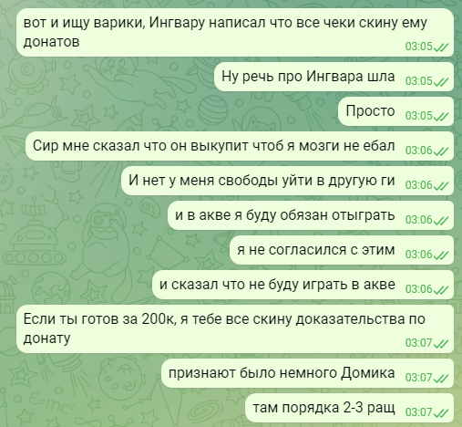
    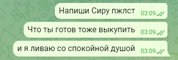

    Другой соги
    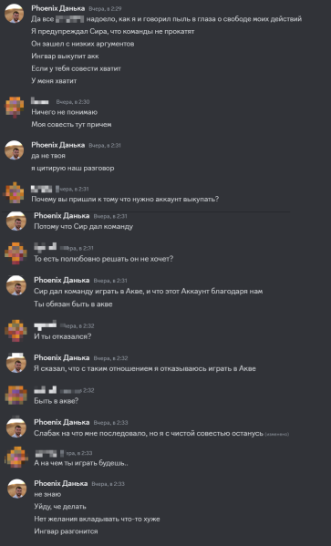

!!! quote "![assm][4]{width=32} **_Assmodeus_**"

    •Спиралл и Кисс очка зовут меня в войс:

 
    Содержание: "Давай решим, почему ты так относишься к акве", на что я ответил, что не  хочу с таким отношением играть там. Мунвар:"Настолько сильная неприязнь к акве? Пох:"Мы же договаривались"(отсылка к условию, что я ОБЯЗАН играть в Аквилоне своим аккаунтом". Я ливнул с этого войса. Предложений в этом войсе о выкупе акка не было.

    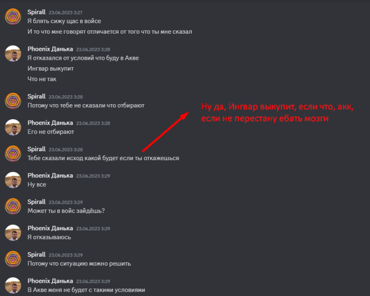
    
    

    mfw
    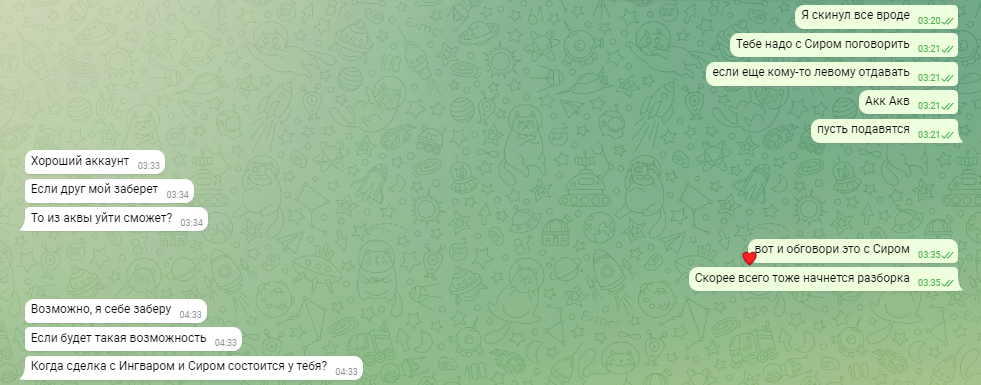
    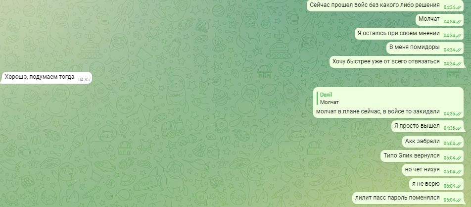

!!! quote "![assm][4]{width=32} **_Assmodeus_**"

    •Поступают скрины из совета: Отжать акк у истерички Дани, Элитсир "вернулся".
 
    *Я успеваю привязать свой гугл к аккаунту. Поступают скрины, где <pohoyoo> уболтал хозяина моего акка поменять пароли.

    Источник из совета, цитата:«Да это пох Элитсиру написал в итоге, тот поблагодарил что аккаунт поддерживается, а не умер и в конце добавил что обязательно вернется в игру»
    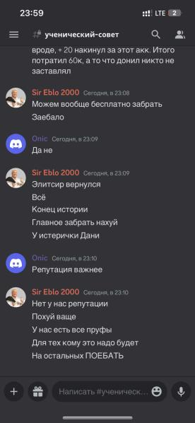
    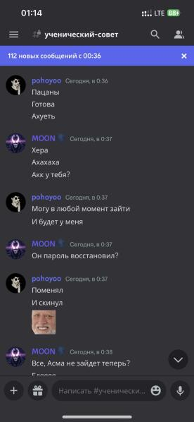

#### La Finale

!!! quote "![assm][4]{width=32} **_Assmodeus_**"

    •На аккаунте начинается активность, заходит другой человек. Сообщения о договоренностях выкупить аккаунт не поступало. Я начал сливать накопления с моих донатов.
    •Я пишу владельцу аккаунта, объясняю ситуацию. Из разговора узнаю о несостыковках с договоренностями <pohoyoo>. Оказалось, что вдобавко он (Пох) наговорил Элитсиру, будто дал мне ВРЕМЕННО аккаунт.
    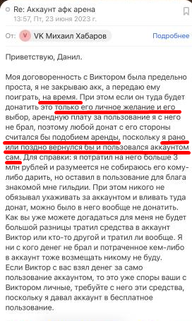

    •Разговор с <pohoyoo>: 
    *Я ему написал, что накопления доната компенсировал. Сказал, что они могут выкупить аккаунт за 60к рублей и я отдам им гугл почту.
    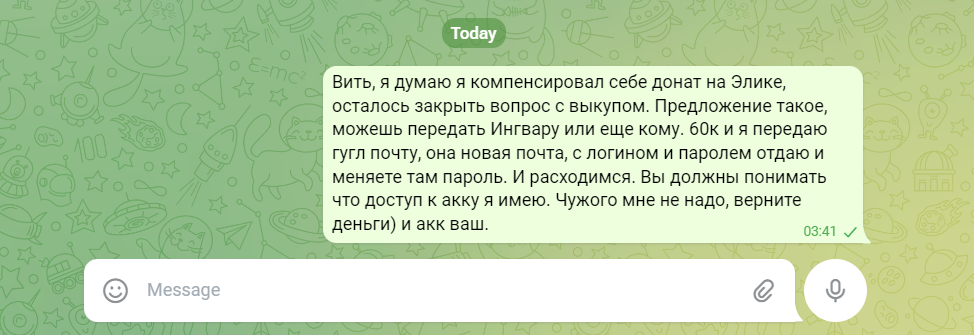
    •Конец истории. Акк оказался таинственным образом в бане.

!!! quote "![assm][4]{width=32} **_Assmodeus_**"

    В заключении: с моей стороны был косяк, что мне не следовало резко топить акк с ресурсами. Надо было дать им понять, что доступ к аккаунту я имел, даже после изменения пароля в учетке Лилит Пасс, и  дать им время обдумать, что делать дальше. Как видно из диалогов, цели уйти с акком в другую гильдию у меня не было, акк я готов был спокойно передать с выкупом обратно Аквилону. Но с их стороны первые неверные действия начались, что побудило меня совершить мой косяк. В Коалиции было очень много приятных в общении людей, с кем было очень классно проводить время. Моя история это лишь про то, как самодурство некоторых людей из руководства может привести к фатальным ошибкам. Берегите себя и своих близких )

[1]: ../../assets/images/aquavon/image-15.png
[2]: ../../assets/images/aquavon/image-16.png
[3]: ../../assets/images/aquavon/image-17.png
[4]: ../../assets/avatars/assmodeus.webp
[5]: ../../assets/avatars/deliav.png
<!-- [6]: -->
<!-- [7]: -->
<!-- [8]: -->
<!-- [9]: -->
<!-- [10]: -->
<!-- [11]: -->
<!-- [12]: -->
[13]: ../../assets/avatars/av_small.jpg
<!-- [14]: -->
<!-- [15]: -->
