!!! warning "DISCLAIMER"

    Что автор знал про Аквилон до начала работы над этим текстом?  
    >Это вроде они мемные видео после бездны делают и главный у них, рукалицо или вроде того, любит на публику играть со смешными постами, верно?.  
    
    Так вот 2 истории, и если первая история лаконична и ясна (_а кто-то скажет что стара как мир, и будет прав в чем-то_).  
    То во второй черт ногу сломал, но ваш слуга постарался разобраться насколько это возможно, в тонкостях этой петрушки.  
    Текст историй приведен практически _as-is_ с минимально необходимой редактурой.  
    После каждой истории оставил скромное мнение, не претендующее на объективность.  
    Наводку оставлю [тут для истории][origin]{:target="_blank" rel="noopener noreferrer"} 

## 1. Подарок

### История Delian

<figure markdown>

|                    Хроника событий                     |                        _Привет_                        |
|:------------------------------------------------------:|:------------------------------------------------------:|
| 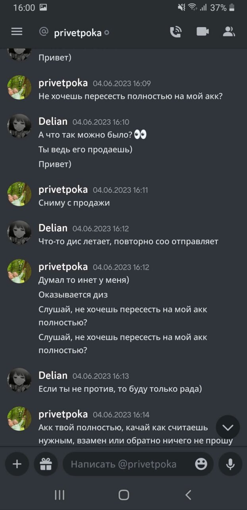 |  |
|  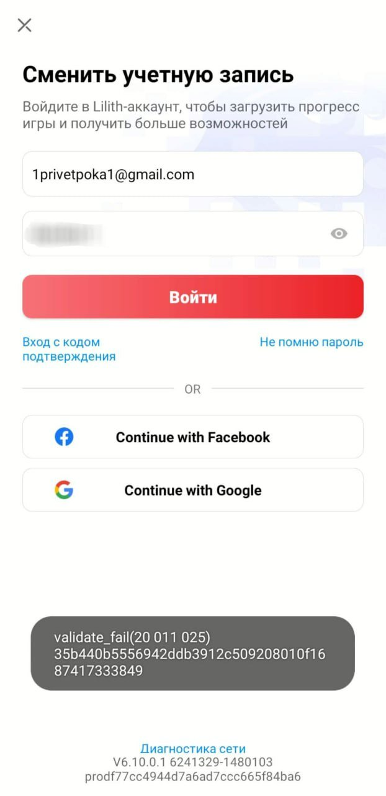  |  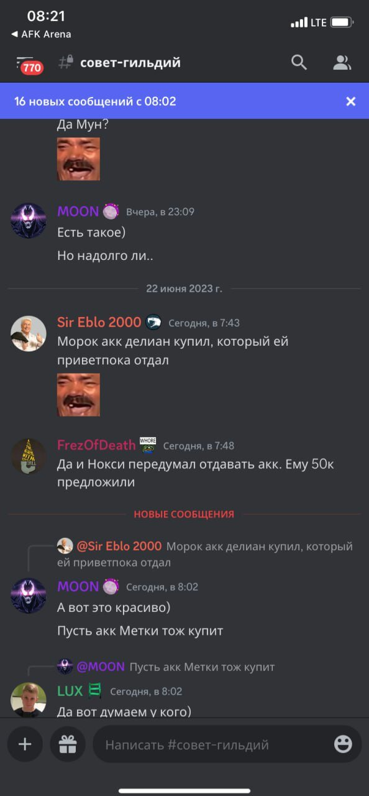  |
|                                                        |                       **_Пока_**                       |

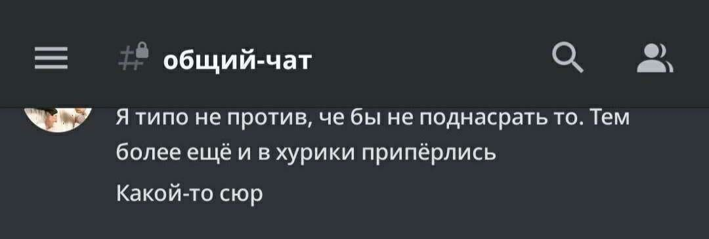

<figcaption>Новый владелец аккаунта, он же Морок</figcaption>
</figure>

### Реакция пострадавшей стороны

!!! quote "![deli][5]{width=32} **_Delian_**"

    >Не думаю, что моя информация принесёт хоть какой-то толк, так как аккаунт не был куплен, предыдущий владелец с которым мы были в
    хороших отношениях, попросту решил отдать его мне. :)  
    С Аквой были довольно натянутые отношения.  
    Были конфликты с некоторыми личностями, но в последнее время с Сиром.  
    Человек привык к тому, что он главный и что все полоумно должны слушаться его, я же не всегда соглашалась с ним, вступала в спор, который переходил на срач, после чего получала кик с сервера, либо мут на 6 дней.  
    Чисто из-за того, что высказывала свое мнение, как и другие ребята, которых не устраивало поведение Сира, точнее его отношение к людям.  
    Сама не являюсь идеальным человеком, было много косяков, но такие поступки максимально низкие.  
    Сколь бы сильно тебе был неприятен человек, зачем подговаривать своих согильдийцев поступать столь подло?  
    До выхода из гильдии списалась с человеком, мол не будет ли он против того, что перейду в другую гильдию, так как мне было предельно важно узнать его мнение.  
    Будь он против, то без проблем передала бы аккаунт ему, а если бы дал добро, то тут уже понятно.  
    Спустя какое-то время ушла из гильдии, вступила в Хурики.  
    Буквально день просидела, а утром уже минус аккаунт был.  
    Как мне сказали, Морок с которым у нас были плохие отношения, который состоит в акве, решил поднасрать и ночью купил аккаунт.  
    Помимо этого, аква решила поднасрать и другому игроку - Черная Метка, хотели связаться с человеком у которого она купила аккаунт.  

### Независимое мнение

!!! quote "![hoot][13]{width=32} _**HOOTSMAN**_, Лев Николаевич"

    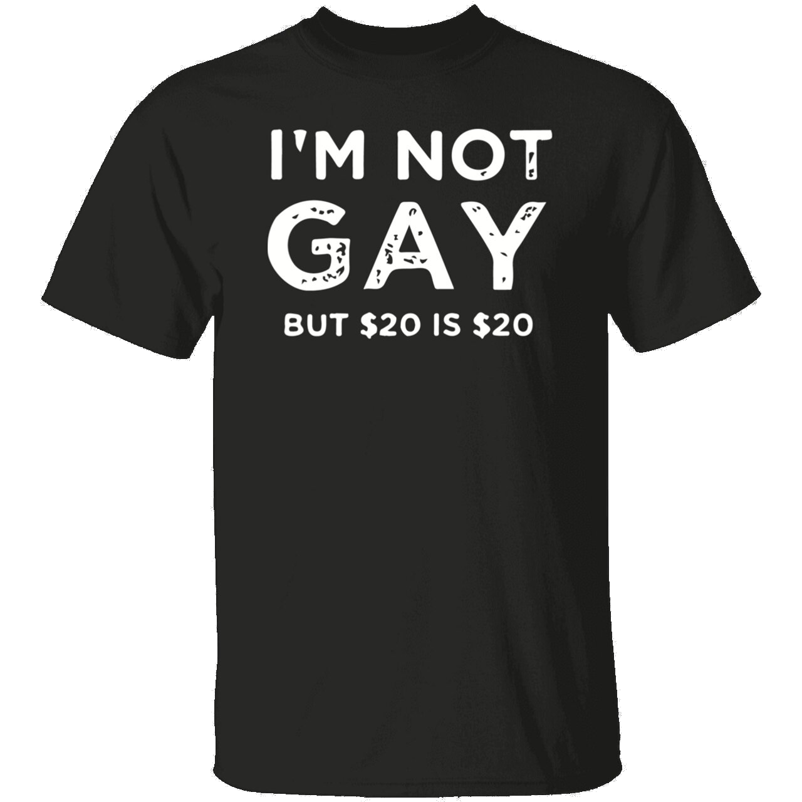{ align=right width=210}
    В произошедшем инциденте,  
    чисто технически, никто никому ничего не должен.  
    Ваши ожидания исключительно ваши проблемы, как говорится.  
    Но по человечески, по _совести_, крайне сомнительное поведение.  
    Пусть это остается на совести первоначального владельца аккаунта, карма обязательно возьмет свое.  
    Можно вручить ему подарок даже, отличная футболка!

***

## 2. Ass We Can

### История Assmodeus

!!! info "Действующие лица"

    - _phoenixdanay_ так же известный как _Assmodeus_
    - _Pohoyoo_ - HH Aquilon
    - _Elitsire_ - изначальный владелец аккаунта _Ассмодеуса_
    - _Сир, Sir Eblo 2000_ - **ГМ Аквилона**
    - _Эмбер_ - Игрок давно продавший акк _Асмодеусу_, который в последствии _Pohoyoo_ продал _Черной Метке_.
    - _Черная метка_- Купила аккаунт у _Pohoyoo_, который был **отдан** <u>Ассмодеусом</u> _Pohoyoo_ при условии, что его не продадут
    - _Ингвар, Sir Eblo 2.000[^ss]_ или _Дааа_ - Состоит в совете Аквилона, был не против выкупить акк у Ассмодеуса
    - _Delian_ и _ПриветПока_(ПП) - герои из предыдущей части.

[^ss]: "Подражает ГМу аквы, но это два разных участника событий."

#### Завязка

!!! quote "![assm][4]{width=32} **_Assmodeus_**"

    Изначально играл на аккаунте _Эмбер_. Потом главный HR Аквы _Pohoyoo_ приводит _Elitsir_ в Акву, но тот вскоре уходит из игры, оставив аккаунт _Pohoyoo_. Мы с ним договариваемся о том, что я выкупаю аккаунт _Elitsir_'а за 20к рублей + отдаю дельфиний акк _Эмбер_ и он на нем будет играть.

    Диалог по поводу выкупа аккаунта _Elitsir_ ниже на скриншотах.

    **Договоренности**: Аккаунт _Elitsir_ остается в акве, акк _Эмбер_, с которого пересел я, не продается на случай, если владелец Элитсира возвращается в игру, что бы была возможность пересесть обратно.

    ??? example "Очень много скриншотов переписки"

        
        ![1][l1]
        ![2][l2]
        ![3][l3]
        ![4][l4]
        ![5][l5]
        ![6][l6]
        ![7][l7]
        ![8][l8]
        ![9][l9]
        ![10][l10]
        ![11][l11]
        ![12][l12]
        ![13][l13]
        ![14][l14]
        ![15][l15]
        

[l1]: ../../assets/images/aquavon/image.jpg
[l2]: ../../assets/images/aquavon/image-1.jpg
[l3]: ../../assets/images/aquavon/image-2.jpg
[l4]: ../../assets/images/aquavon/image-3.jpg
[l5]: ../../assets/images/aquavon/image-4.jpg
[l6]: ../../assets/images/aquavon/image-5.jpg
[l7]: ../../assets/images/aquavon/image-6.jpg
[l8]: ../../assets/images/aquavon/image-7.jpg
[l9]: ../../assets/images/aquavon/image-8.jpg
[l10]: ../../assets/images/aquavon/image-9.jpg
[l11]: ../../assets/images/aquavon/image-10.jpg
[l12]: ../../assets/images/aquavon/image-11.jpg
[l13]: ../../assets/images/aquavon/image-12.jpg
[l14]: ../../assets/images/aquavon/image-13.jpg
[l15]: ../../assets/images/aquavon/image-14.jpg

#### Сходка, начало проблем

!!! quote "![assm][4]{width=32} **_Assmodeus_**"

    На сходке Аквилона выясняется, что _pohoyoo_ продал аккаунт _Ember_, Метке и утверждает, что _Элитсир_ точно не вернется в игру.  
    ![Дружный коллектив][c1]{width=350 align=right style="padding:15px;border-radius:10px;"}
    Начинаются непонятки в Аквилоне: в ги царит крайне токсичная атмосфера, разборки до и во время бездны.  
    Отношение совета Аквы к факту подлого отжатия аккаунта у _Delian_  
    В дискорде регулярно творилась жесть в плане отношения к людям, постоянные оскорбления, унижения и перегиб с полномочиями, мне **это** совершенно не нравилось.  
    _Морок_, не входящий в совет Аквы, сам акк _Делиан_ купил у _ПриветПока_, но убил сам факт "<u>поддержки</u>" совета поднасрать ей.  
    ![Чай и печеньки][c2]{width=330 align=left style="padding:15px;border-radius:10px;"}

    Не хочу, чтобы получилось так, будто меня подговорили уйти с ГИ, ведь это абсолютно не так[^leave].  
    _Сир_ уже думает, что существует Коалиция "АНТИ СИР", с чего я поржал.  
    Волнения из-за постоянных токсичных разборок в Акве, где совет со стороны Аквы делает что захочется.  
    Сир подшофе мог зайти в дискорд и просто так всех обматерить и недовольные этим игроки, если высказывались то сразу попадали в мут, или вообще исключались из дискорда. Потом Сир их возвращал, конечно, с "барского плеча", так сказать.  
    Когда создалась Коалиция[^coal], люди из совета мне говорили, что специально сделали так, чтобы ГМ не могли исключать игрока из другой гильдии, но никто не отменял муты.  
    В Акве единственное верное мнение и решение только у Сир'а, только жаль, что с ним были многие не согласны, и несогласные делились на два лагеря:

      1. Не согласны, ну и не обращать на него внимание.
      2. Не согласны, и получать мут или оскорбления за высказывания противоположного мнения

    Сир любит говорить, что мы воюем против ветра.  
    И вся эта шняга гнилая, которая происходила в совете мне была интересна, хотел понять, с какой тактикой вообще Сир работает.  
    Не хотел уходить из Коалиции 3 гильдий, поскольку было много добрых и хороших ребят, с которыми было комфортно. Про него некоторые говорили, что он весьма адекватен, если 1 на 1 общаться, и понимает что происходит.  
    Но самое противное - его Эго, которое убивало напрочь желание играть в Акве. Ведь все ОН, все благодаря ЕМУ, всех может поносить, и как он скажет, так и будет.

    ??? danger "Обычное общение в Акве | МНОГО НЕЦЕНЗУРНОЙ ЛЕКСИКИ"

        | ![сир сапожник][1]  | ![сир сапожник][2]             |
        |---------------------|--------------------------------|
        | ![сир сапожник][3]  | ![альтернативный сапожник][6]  |
        | ![сир сапожник][x1] | ![альтернативный сапожник][x2] |
        | ![сир сапожник][x3] | ![альтернативный сапожник][x4] |

        <figure markdown>
          ![клуб сапожников][7]
        </figure>

    ***

    ![Alt text][c3]{width=350 align=right style="margin:35px;"}
    Внезапно мне пишут: 
    > Не донать в акк, помяни мое слово, отожмут аккаунт"

    Пишу Сир'у по поводу предостережений, что аккаунт отожмут, состоялся долгий и весьма в добром ключе разговор.
    Одна из тем, где я отыграю бездну, я собирался остаться в Этернумах. Так же подробно обсуждали прошедшие срачи и беспокойство, что заберут у меня аккаунт.

    ??? danger end "Разговор с Сиром | МНОГО НЕЦЕНЗУРНОЙ ЛЕКСИКИ"

        | 1. ![Alt text][s1] | 2. ![Alt text][s2] |
        |--------------------|--------------------|
        
        ![Alt text][s3]
        
    Написал _pohoyoo_, он заверил, что никто не заберет аккаунт.  
    Подумал, что могу играть где захочу, ведь не написали, что надо играть точно в акве.

    

        <video width="320" height="240" controls>
            <source src="/afk.GG/assets/vids/assmodeus.webm" type="video/webm">
        </video>  
    

    В войсе помимо меня был Сир и зам Бореас, поднялась тема бездны, хотел отыграть в Ethernum, но Сир в приказном порядке говорит отыграть в Акве, мол, "вы получили аккаунты благодаря Акве, вы мне обязаны", после чего состоится такой диалог:
    >-Если что, Ингвар выкупит акк, если ты продолжишь делать мозги. Если хватит тебе совести.  
    -Совести хватит  
    -Ну и слабак, мог бы спокойно отыграть с нами.  

    Желания продолжать разговор уже не было, я сказал что уйду поработать.  
    Пришло понимание что ситуация тупиковая и стоит постараться хотя бы отбить собственные вложения.  
    Сразу же после войса написал Ингвар'у о предложении выкупа.  

[c1]: ../../assets/images/aquavon/image-20.jpg
[c2]: ../../assets/images/aquavon/image-21.jpg
[c3]: ../../assets/images/aquavon/image-22.jpg
[s1]: ../../assets/images/aquavon/image-23.jpg
[s2]: ../../assets/images/aquavon/image-24.jpg
[s3]: ../../assets/images/aquavon/image-26.jpg

#### Поиск выхода

!!! quote "![assm][4]{width=32} **_Assmodeus_**"

    Написал Ингвар'у в телеграмме
    <figure markdown>
        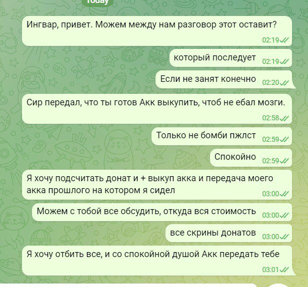
    <figcaption>Он так и не ответил.</figcaption>
    </figure>
    
    Параллельно начал искать альтернативные варианты  
    Узнавал у другого соги Аквы, может ли он выкупить аккаунт.  
    <figure markdown>

    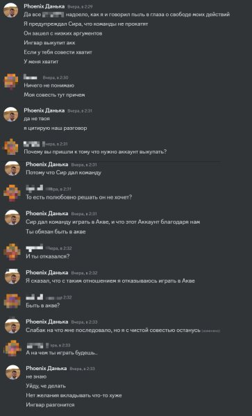{align=right}
    {align=left width=50%}
    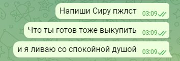{align=left}
    </figure>

    Спиралл и Кисочка позвали в войс.  
    Содержание: 
    > "Давай решим, почему ты так относишься к акве",  

    Отвечаю что желания играть с таким отношением не прибавилось.  
    
    > _Мунвар_: "Настолько сильная неприязнь к акве?  
    _Пох_: "Мы же договаривались"[^deal].  
    
    Ливнул с войса т.к. предложений о выкупе акка не было.
    <figure markdown>

    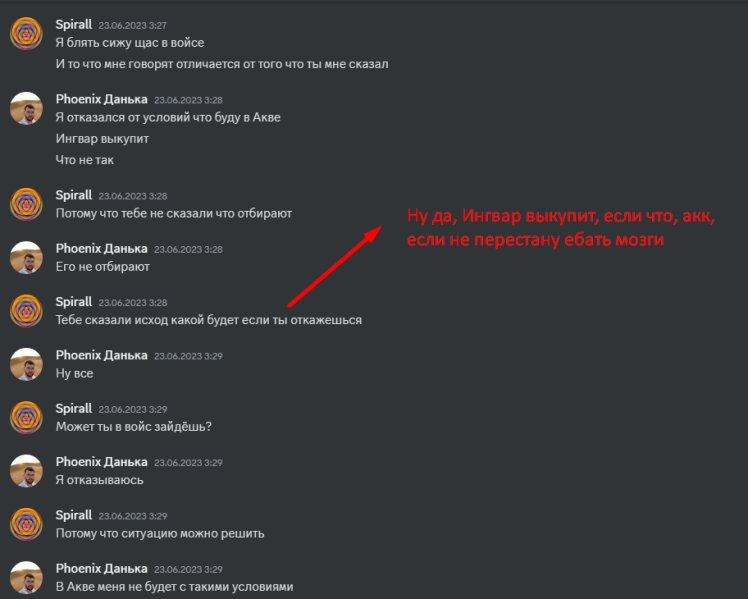{width=700}
    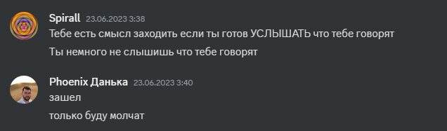{width=700}
    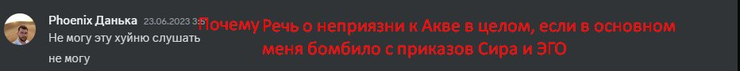{width=700}
    <figcaption>???</figcaption>
    </figure>

    <figure markdown>

      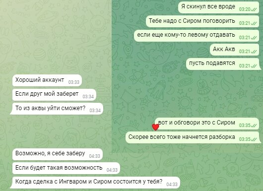{width=700}
      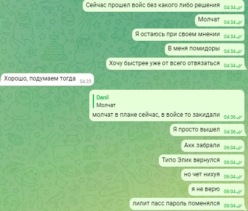{width=700}
      <figcaption>В это же время вроде появился вариант нормального урегулирования вопроса. Но...</figcaption>
    </figure>

    | После этого успеваю привязать свой гугл к аккаунту.   | pohoyoo все же уболтал _Elitsire_ поменять пароли.    |
    |-------------------------------------------------------|-------------------------------------------------------|
    | 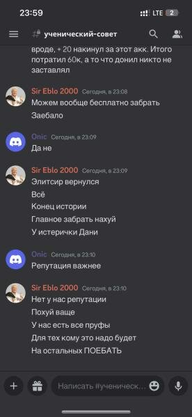 |  |

    Источник из совета:
    >«Да это пох Элитсир'у написал в итоге, тот поблагодарил что аккаунт поддерживается, а не умер и в конце добавил что обязательно вернется в игру»

[^deal]: отсылка к условию, что я ОБЯЗАН играть в Аквилоне своим аккаунтом
[^coal]: Коалиция состояла из трех гильдий - Этернум, Бореас, Аквилон

#### La Finale

!!! quote "![assm][4]{width=32} **_Assmodeus_**"

    На аккаунте начинается активность, заходит другой человек.  
    Сообщения о договоренностях выкупить аккаунт не поступало.  
    Начал сливать накопления со своих донатов.  
    Пишу владельцу аккаунта, объясняю ситуацию.  
    Из разговора узнаю о нестыковках с договоренностями _pohoyoo_. Оказалось, что вдобавок Пох наговорил Элитсир'у, будто дал мне ВРЕМЕННО аккаунт.  
    <figure markdown>

    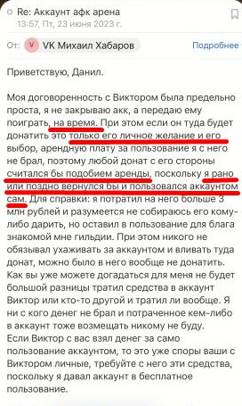
    <figcaption></figcaption>
    </figure>

    <figure markdown>

    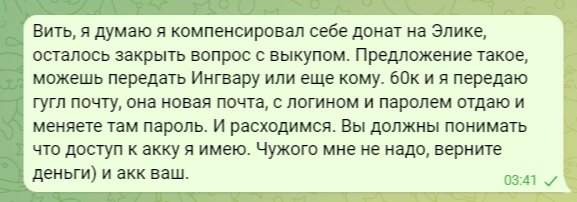
    <figcaption>Пишу Поху</figcaption>
    </figure>

    Акк оказался таинственным образом в бане.  
    **Конец истории.**

!!! quote "![assm][4]{width=32} **_Assmodeus_**"

    В заключении: с моей стороны был косяк, что мне не следовало резко топить акк с ресурсами.  
    Надо было дать им понять, что доступ к аккаунту я имел, даже после изменения пароля в Лилит Пасс, и  дать им время обдумать, что делать дальше.  
    Как видно из диалогов, цели уйти с акком в другую гильдию у меня не было, акк я готов был спокойно передать с выкупом обратно Аквилону.  
    Но с их стороны первые неверные действия начались, что побудило меня совершить мой косяк.  
    В Коалиции было очень много приятных в общении людей, с кем было очень классно проводить время.  
    Моя история это лишь про то, как самодурство некоторых людей из руководства может привести к фатальным ошибкам.  
    Берегите себя и своих близких )

### Комментарий администрации Аквилона

!!! quote "![moon][16]{width=32} _**MOONWAR**_"

    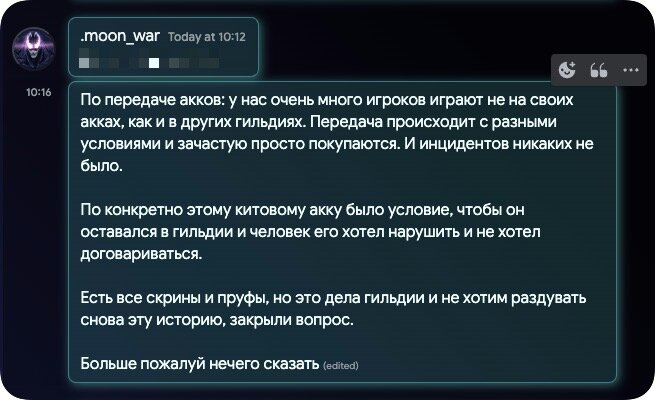

### Мнение со стороны

!!! quote "![hoot][13]{width=32} _**HOOTSMAN**_, Лев Николаевич"

    Ситуация конечно, мягко скажем дерьмовая.  

    **Вынужден напомнить** что этой стране (да и не только) **незнание законов не освобождает от ответственности**.  
    А всем участникам стоит ознакомиться со статьями [159][9] [159.3][12], [160][8], [161][14], [163][15] ,[165][10] и [167][11] УК РФ.  
    В особенности тому кто дважды распорядился чужим имущество для получения финансовой выгоды.  
    Насколько понял этот молодой человек пока еще студент, а уже в уголовники рвется, не к добру это, но дело конечно его.  

    Хоть _Мун_ и утверждает что там все ровно и с пруфами, но сейчас факты складываются так, что _Pohoyoo_, первоначально совершил преступление, продав чужой акк, не имея никаких прав на это.  
    Не смотря на то что такая сделка **не может** в принципе **налагать** каких-либо **обязательств** сторон, он совершает второе преступление аналогичного характера, продавая другой акк Метке в нарушение договоренностей.  
    Давно привык что в ру сообществе, бывает, вопиюще пренебрегают моральным нормами поведения, но преступать УК РФ это вообще за гранью понимания, при этом иметь смелость требовать от человека исполнения каких то обязательств.  
    А если имели место быть угрозы[^t] то там еще пару статей можно подтянуть .  
    Буду очень рад ошибаться на этот счет, потому что видеть такое в сообществе крайне неприятно и досадно.  

    Пока имеется факт преступления УК РФ, погружаться в какие-то хитросплетения внутригильдейских условностей не имеет никакого смысла.  
    На этом у меня все.

[^leave]: Тут Assmodeus подразумевает [этот пост Сира][darmamu]
[^t]: такие к [примеру][treat]{:target="_blank" rel="noopener noreferrer"}

[1]: ../../assets/images/aquavon/image-15.jpg
[2]: ../../assets/images/aquavon/image-16.jpg
[3]: ../../assets/images/aquavon/image-17.jpg
[4]: ../../assets/avatars/assmodeus.webp
[5]: ../../assets/avatars/deliav.png
[6]: ../../assets/images/aquavon/image-18.jpg
[7]: ../../assets/images/aquavon/image-19.jpg
[8]: https://www.consultant.ru/document/cons_doc_LAW_10699/4641cfe1bdfab945ead3ae228d36c3e8141dd9f1/
[9]: https://www.consultant.ru/document/cons_doc_LAW_10699/8012ecdf64b7c9cfd62e90d7f55f9b5b7b72b755/
[10]: https://www.consultant.ru/document/cons_doc_LAW_10699/598fbbd993948ff493e853c0845161561b01f0a5/
[11]: https://www.consultant.ru/document/cons_doc_LAW_10699/d260e55e06d1e6bc720d2e591a8383a43b1a5eed/
[12]: https://www.consultant.ru/document/cons_doc_LAW_10699/c193654ae5c3bd5b02d92ade18796cd8864ec353/
[13]: ../../assets/avatars/av_small.jpg
[16]: ../../assets/avatars/moon.webp
[14]: https://www.consultant.ru/document/cons_doc_LAW_10699/8727611b42df79f2b3ef8d2f3b68fea711ed0c7a/
[15]: https://www.consultant.ru/document/cons_doc_LAW_10699/3cf93ca64f2a009e75430fc6394b66a3642ba176/

[x1]: https://cdn.discordapp.com/attachments/1121769153611694110/1122601065418854580/SmartSelect_20230528_162134_Discord.png
[x2]: https://cdn.discordapp.com/attachments/1121769153611694110/1122600804851916850/SmartSelect_20230610_032307_Discord.png
[x3]: https://media.discordapp.net/attachments/1121769153611694110/1122600804466036909/SmartSelect_20230610_032252_Discord.png
[x4]: https://cdn.discordapp.com/attachments/1121769153611694110/1122600804042408026/SmartSelect_20230610_025348_Discord.png
[treat]: https://cdn.discordapp.com/attachments/1121769153611694110/1121896773779198003/5a95ff8d-a836-4111-adc0-aea465b66951.png
[darmamu]: https://media.discordapp.net/attachments/1121769153611694110/1121902025735680070/b2fef5b0-1c81-408c-8eaf-13a16739b9c1.png
[origin]: https://media.discordapp.net/attachments/976976670345035796/1124059283458367599/image.png
