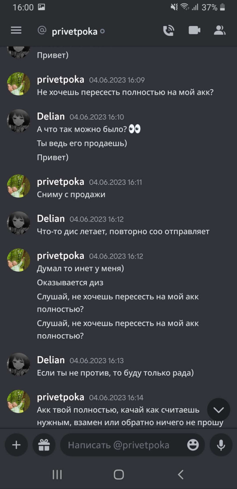

# Особенности национальной торговли

## 1. Подарок

### История Delian

<figure markdown>

|                  привет |                         |
| ----------------------: | ----------------------: |
|  |  |
|    |    |
|                         |                    Пока |

<figcaption>Хроника событий</figcaption>
</figure>
<figure markdown>

<figcaption>Владелец аккаунта, он же privetpoka</figcaption>
</figure>

### Реакция пострадавшей стороны

!!! quote "**_Delian_** 23.06.2023. 14:27:39"

    >Привет, я не думаю, что моя информация принесёт хоть какой-то толк, так как аккаунт не был куплен, предыдущий владелец с которым мы были в
    хороших отношениях, попросту решил отдать его мне.)  
    С Аквой были довольно натянутые отношения, были конфликты с некоторыми личностями, но в последнее время с Сиром, человек привык к тому, что он
    главный и что все полоумно должны слушаться его, я же не всегда соглашалась с ним, вступала в спор, который переходил на срач, после чего
    получала кик с сервера, либо мут на 6 дней, чисто из-за того, что высказывала свое мнение, как и другие ребята, которых не устраивало поведение
    Сира, точнее его отношение к людям.  
    Я сама не являюсь идеальным человеком, было много косяков, но такие поступки максимально низкие.  
    Сколь бы сильно тебе был неприятен человек, зачем подговаривать своих согильдийцев поступать столь подло?  
    Я до выхода из гильдии списалась с человеком, мол не будет ли он против того, что я перейду в другую гильдию, так как мне было предельно важно
    узнать его мнение.  
    Буль он против, то я бы без проблем передала аккаунт ему, а если бы дал добро, то тут уже понятно.  
    Спустя какое-то время ушла из гильдии, вступила в Хурики. буквально день просидела, а утром уже минус аккаунт был.  
    Как мне сказали, Морок с которым у нас были плохие отношения, который состоит в акве, решил поднасрать и ночью купил аккаунт.  
    Помимо этого. Аква решила поднасрать и другому игроку - Черная Метка, хотели связаться с человеком у которого она купила аккаунт.  

### Независимое мнение

!!! example "HOOTSMAN, Лев Николаевич"

    { align=right width=250}
    В произошедшем инциденте,  
    чисто технически, никто никому ничего не должен.  
    Ваши ожидания исключительно ваши проблемы, как говорится.  
    Но по человечески, по _совести_, крайне сомнительное поведение.  
    Пусть это остается на совести первоначального владельца аккаунта, карма обязательно возьмет свое.  
    Можно вручить ему подарок даже, отличная футболка!

## Ass we can

!!! info "Действующие лица"

    - _phoenixdanay_ так же известный как _Assmodeus_
    - _Эмбер_ - Игрок давно продавший акк _Асмодеусу_, который в последствии был продан _Черной Метке_.
    - Pohoyoo - HH Aquilon
    - _Черная метка_- Купила аккаунт у _Pohoyoo_, который был **отдан** <u>Ассмодеусом</u> _Pohoyoo_ при условии, что его не продадут
    - _Ингвар, Sir Eblo 2.000[^ss]_ или _Дааа_ - Состоит в совете Аквилона, был не против выкупить акк у Ассмодеуса
    - _Сир, Sir Eblo 2000_ - **ГМ Аквилона**
    - _Эликсир_ - владелец аккаунта _Ассмодеуса_

[^ss]: Подражает ГМу аквы, нно это два разных участника событий.

### История

Началось все с покупки аккаунта Эликсира, который дропнул игру, оставив акк Pohoyoo

{width=600}

<figure markdown>

| 1.  | 2.  |
| :------------------------------------: | :------------------------------------: |
| 3.  | 4.  |
| 5.  | 6.  |
| 7.  |   6\* {width=280}   |

<figcaption>Сделка</figcaption>
</figure>

### Договоренности и начало волнений

<figure markdown>

>  >  >  > 

<figcaption> Asm успел привязать к акку гугл почту и реакция</figcation>
</figure>

<figure markdown>

{width=700}

<figcaption>После этого разговора был Войс_(с кем?)_</figcation>
</figure>

>  > 

|                  1                  |                  2                  |       Ответ владельца аккаунта        |
| :---------------------------------: | :---------------------------------: | :-----------------------------------: |
|  |  |  |

<figure markdown>

>  > 

<figcaption> </figcation>
</figure>

<figure markdown>

<figcaption> </figcation>
</figure>

<figure markdown>

<figcaption> </figcation>
</figure>
