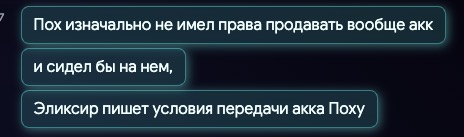

# Особенности национальной торговли

!!! info "Действующие лица"

    - _phoenixdanay_ так же известный как _Assmodeus_
    - _Эмбер_ - Игрок давно продавший акк _Асмодеусу_, который в последствии был продан _Черной Метке_.
    - Pohoyoo - HH Aquilon
    - _Черная метка_- Купила аккаунт у _Pohoyoo_, который был **отдан** <u>Ассмодеусом</u> _Pohoyoo_ при условии, что его не продадут 
    - _Ингвар, Sir Eblo 2.000[^ss]_ или _Дааа_ - Состоит в совете Аквилона, был не против выкупить акк у Ассмодеуса
    - _Сир, Sir Eblo 2000_ - **ГМ Аквилона**
    - _Эликсир_ - владелец аккаунта _Ассмодеуса_
[^ss]: Подражает ГМу аквы, нно это два разных участника событий.

## Ass we can

### История

Началось все с покупки аккаунта Эликсира, который дропнул игру, оставив акк Pohoyoo

{width=600}

<figure markdown>

| 1.  | 2.  |
| :------------------------------------: | :------------------------------------: |
| 3.  | 4.  |
| 5.  | 6.  |
| 7.  |    6* {width=280}    |

<figcaption>Сделка</figcaption>
</figure>

### Договоренности и начало волнений

<figure markdown>

> 
> 
> 
> 
<figcaption> Asm успел привязать к акку гугл почту и реакция</figcation>
</figure>

<figure markdown>

{width=700}

<figcaption>После этого разговора был Войс_(с кем?)_</figcation>
</figure>

> 
> 

|                  1                  |                  2                  |       Ответ владельца аккаунта        |
| :---------------------------------: | :---------------------------------: | :-----------------------------------: |
|  |  |  |

<figure markdown>

> 
> 
<figcaption> </figcation>
</figure>

<figure markdown>

<figcaption> </figcation>
</figure>

<figure markdown>

<figcaption> </figcation>
</figure>
