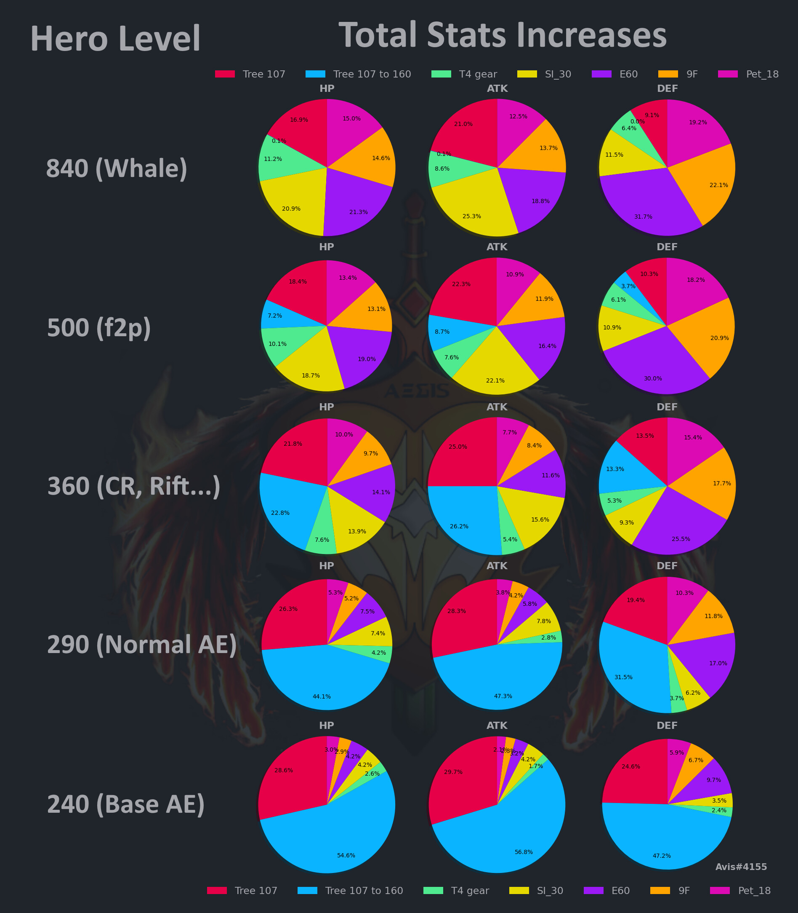
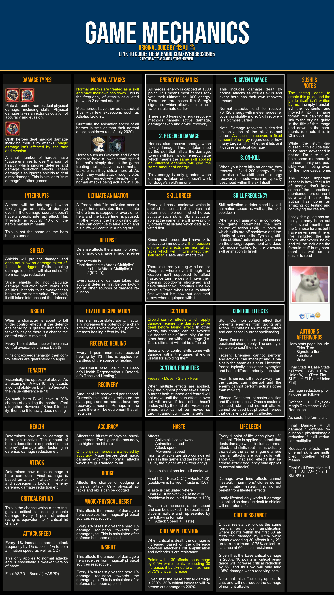
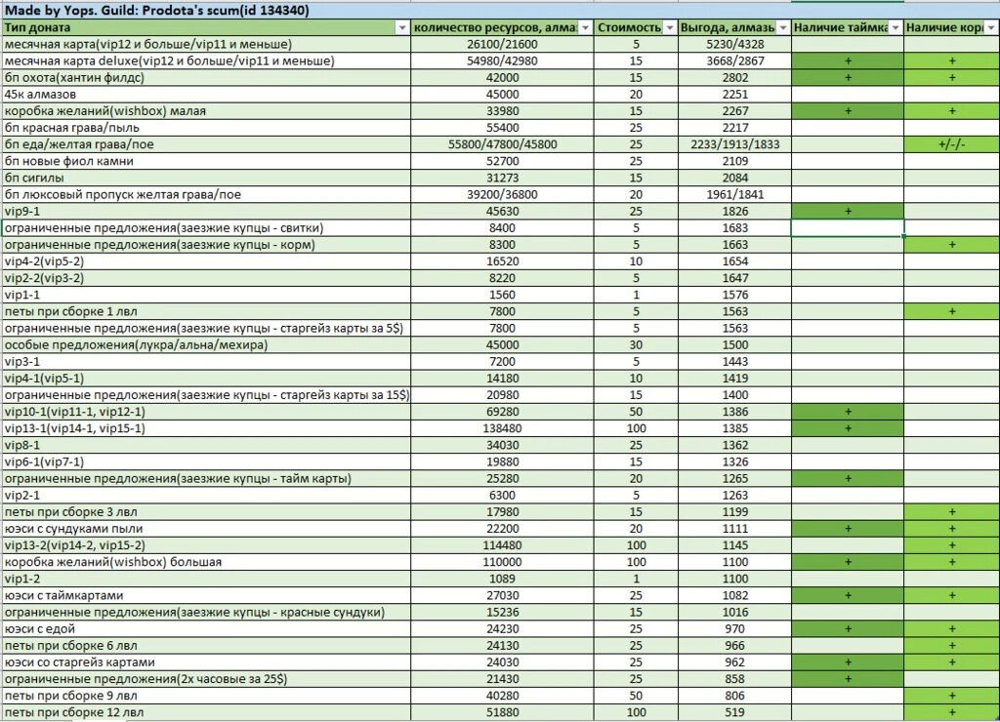
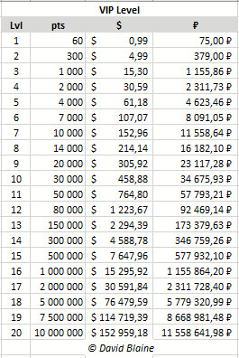
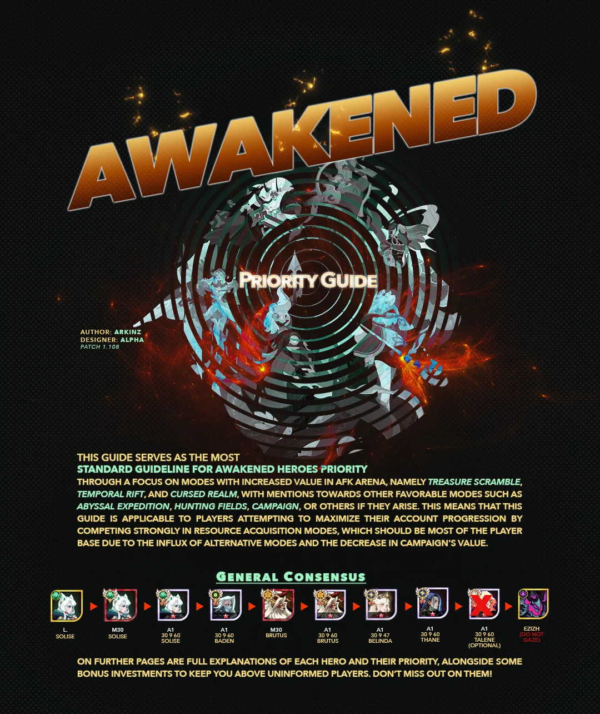
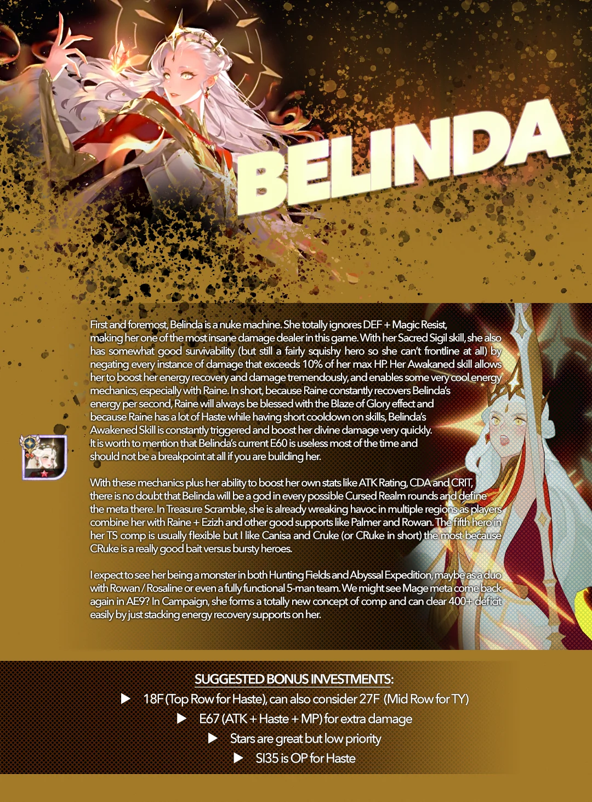
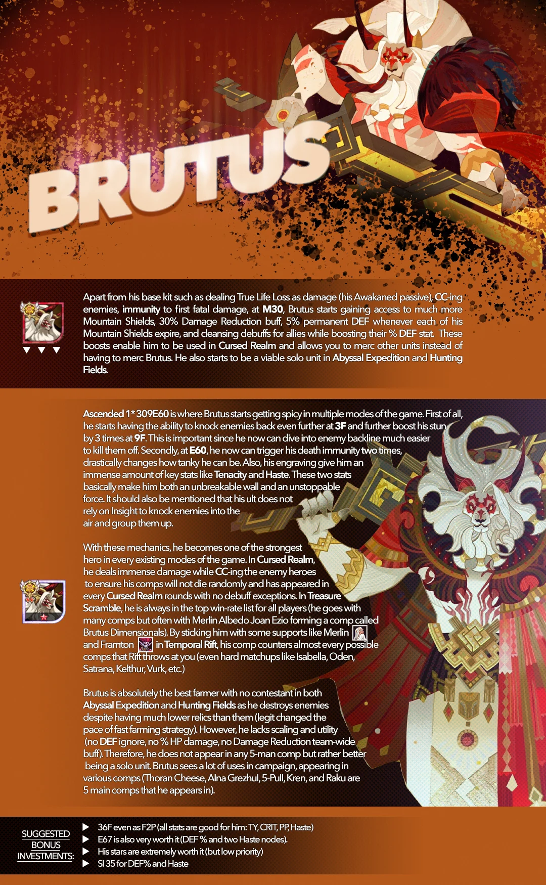
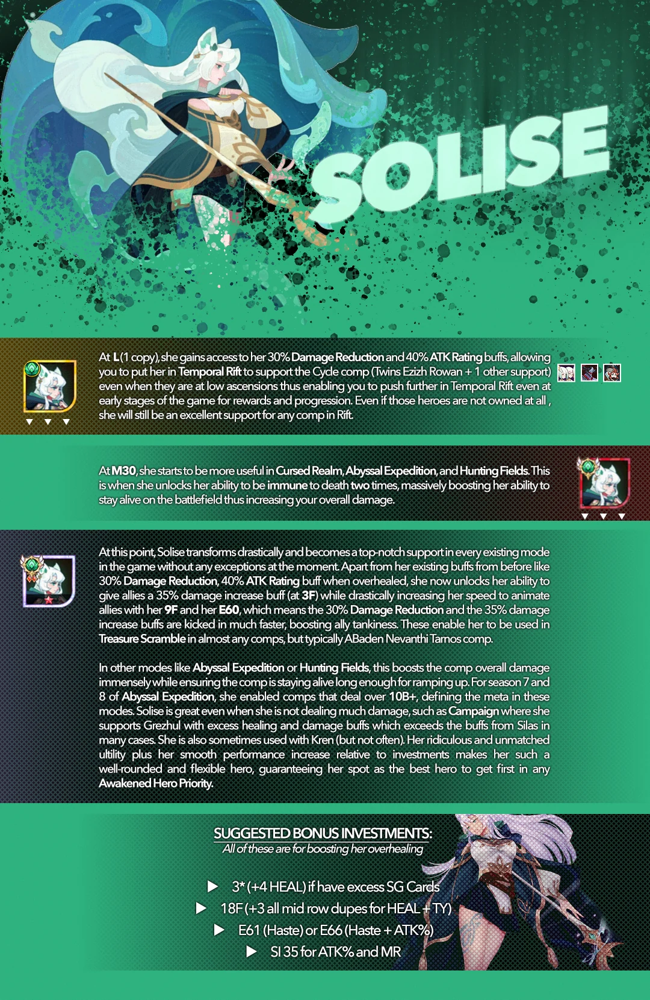
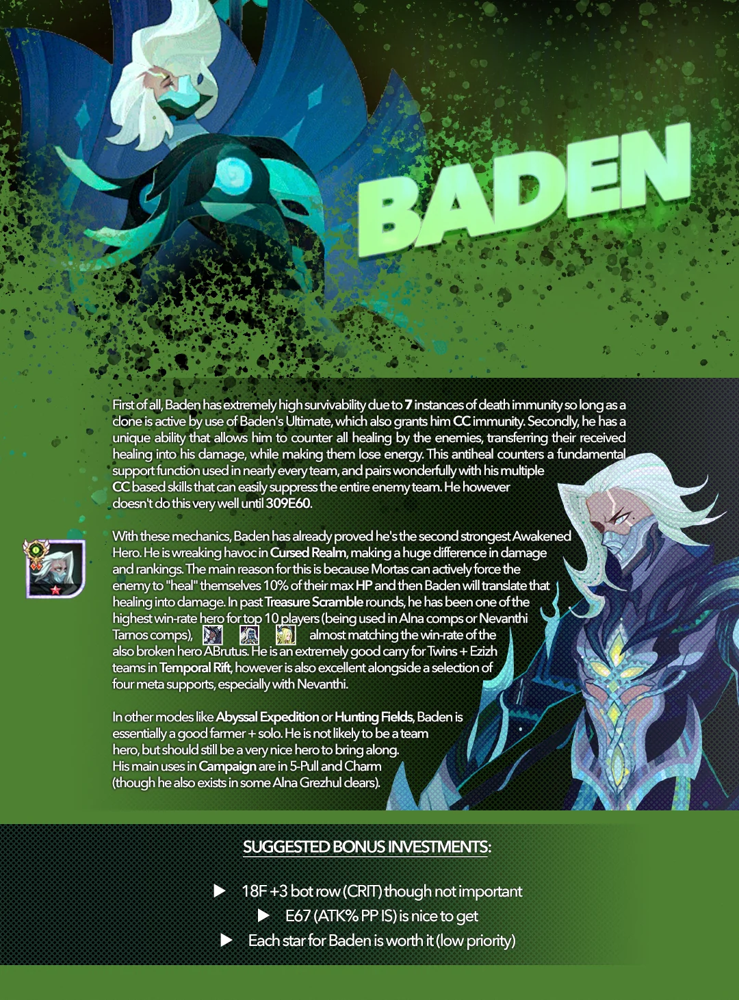
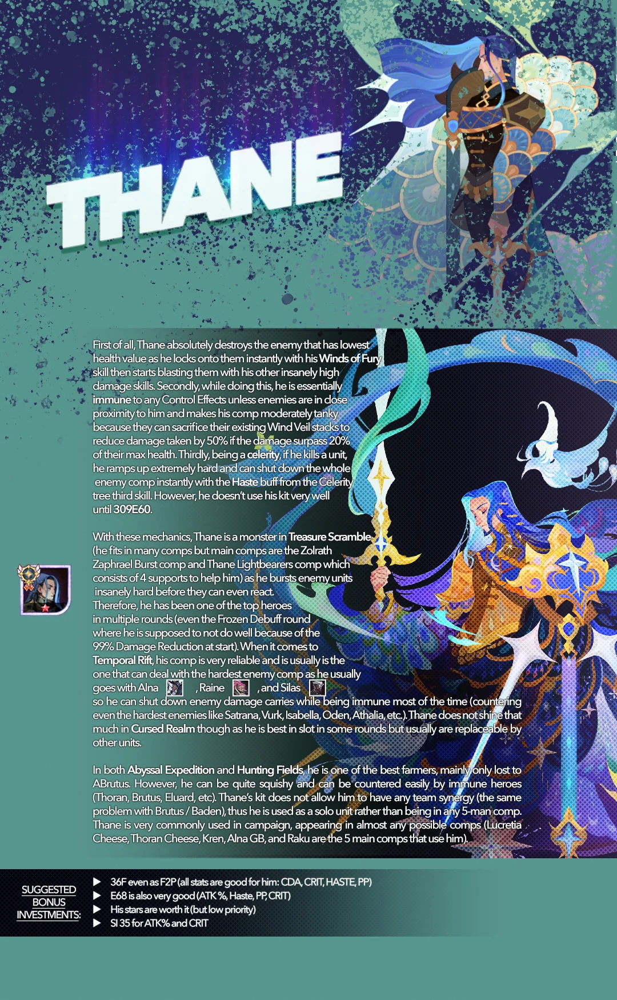

# Picture representations

## Hero stats proportions in different game modes

<figure markdown>

<figcaption>Lil' bit outdated, but still relevant!</figcaption>
</figure>

## Cero Pet Guide

<figure markdown>

<figcaption>Updated 2023-06-23</figcaption>
</figure>

## Game mechanics

<figure markdown>

<figcaption>
mb outdated
</figcaption>
</figure>

better check [bob doc](/afk.GG/kb/links/#game-knowledge)

## SHOP VALUES

<figure markdown>

<figcaption>Relevant</figcaption>
</figure>

## VIP COST

<figure markdown>

| outdated                          | info                               |
| --------------------------------- | ---------------------------------- |
| {width=400} |  {width=400} |

<figcaption>Outdated</figcaption>
</figure>

## Awk. Heroes

<figure markdown>

|  |  |
| ------------------------- | ------------------------- |
|  |  |
|  |   |

<figcaption>Outdated</figcaption>
</figure>

## Furniture enchant + stats

{{ read_excel('../../assets/furnstats.xlsx', engine='openpyxl', na_filter=False) }}
